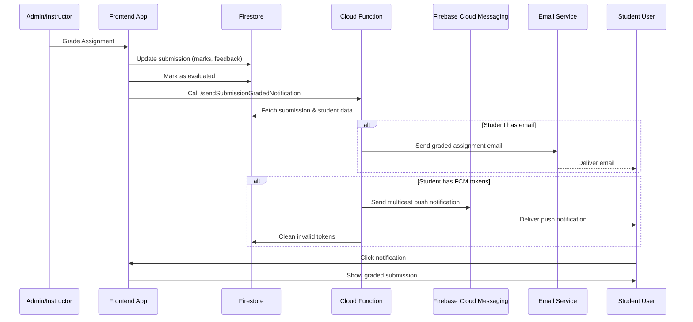
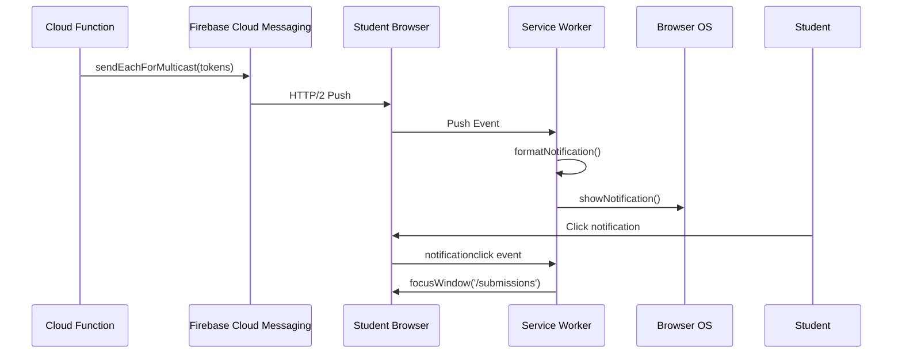

# **Assignment Grading & Notification System Documentation**

## **Table of Contents**
1. [System Overview](#system-overview)
2. [Architecture Flow](#architecture-flow)
3. [Frontend Grading Process](#frontend-grading-process)
4. [Cloud Function Implementation](#cloud-function-implementation)
5. [Push Notification Delivery](#push-notification-delivery)
6. [Email Notification System](#email-notification-system)
7. [Token Management](#token-management)
---

## **1. System Overview**

### **Purpose**
This system automates notification delivery when instructors grade student assignments.

### **Key Components**
- **Frontend Admin Interface**: Grading interface for instructors
- **Firestore Database**: Stores submissions, user data, and FCM tokens
- **Cloud Function**: Handles notification logic and delivery
- **FCM (Firebase Cloud Messaging)**: Push notification delivery service
- **Email Service**: Alternative notification channel

### **Notification Channels**
| Channel | Delivery Time | Persistence | Requirements |
|---------|--------------|-------------|--------------|
| Web Push | Instant | Until dismissed | User online, permission granted |
| Email | Seconds to minutes | Permanent | Valid email address |

---

## **2. Architecture Flow**

### **End-to-End Process Diagram**


### **Data Flow**
1. **Grade Submission** → Update Firestore
2. **Mark Evaluated** → Prevent duplicate admin notifications
3. **Trigger Notification** → Call Cloud Function
4. **Fetch User Data** → Get email & FCM tokens
5. **Dual Delivery** → Send email + push notification
6. **Token Cleanup** → Remove invalid FCM tokens

---

## **3. Frontend Grading Process**

### **3.1 Grading Sequence**

```typescript
// Step 1: Update submission with marks and feedback
await assignmentService.updateSubmission(selectedSubmission.id!, {
  marks: numericMarks,
  feedback: feedback.trim(),
});

// Step 2: Mark as evaluated (prevents duplicate admin notifications)
await markSubmissionEvaluatedService.mark(selectedSubmission.id!, idToken);

// Step 3: Send notification to student
await pushNotificationService.sendGradedNotification(
  selectedSubmission.id!,
  numericMarks,
  getAssignmentTitle(selectedSubmission),
  idToken
);
```

### **3.2 Service Contracts**

#### **`assignmentService.updateSubmission()`**
```typescript
interface UpdateSubmissionParams {
  marks: number;
  feedback: string;
  // Optional: gradedAt timestamp, graderId, etc.
}

// Updates in Firestore: COLLECTION.ASSIGNMENT_SUBMISSIONS/{submissionId}
// Sets: marks, feedback, status: 'graded', updatedAt
```

#### **`markSubmissionEvaluatedService.mark()`**
```typescript
// Purpose: Marks submission as evaluated to prevent duplicate email notifications
// Implementation: Updates evaluation tracking collection
// Why: When students are assigned to admins, admins get email notifications
//      This prevents notifications after grading is complete
```

#### **`pushNotificationService.sendGradedNotification()`**
```typescript
interface GradedNotificationParams {
  submissionId: string;
  marks: number;
  assignmentTitle: string;
  idToken: string; // Authentication token
}

// Calls: POST /sendSubmissionGradedNotification
// Headers: { Authorization: `Bearer ${idToken}` }
// Body: { submissionId, marks, assignmentTitle, ... }
```

---

## **4. Cloud Function Implementation**

### **4.1 Endpoint Specification**
```
POST /sendSubmissionGradedNotification
Content-Type: application/json
Authorization: Bearer <idToken>

Request Body:
{
  "submissionId": "abc123",
  "title": "Assignment Graded",
  "body": "Your submission has been graded successfully.",
  "marks": 85,
  "assignmentTitle": "Machine Learning Project"
}
```

### **4.2 Cloud Function Code Structure**

```typescript
// Main handler function
export const sendSubmissionGradedNotification = functions.https.onRequest(
  async (req, res) => {
    try {
      // 1. Validate request
      validateRequest(req);
      
      // 2. Extract data
      const { submissionId, title, body, marks, assignmentTitle } = req.body;
      
      // 3. Fetch submission data
      const submission = await fetchSubmission(submissionId);
      const studentId = submission.studentId;
      
      // 4. Fetch user data
      const user = await fetchUser(studentId);
      
      // 5. Send email notification
      if (user.email) {
        await sendEmailNotification(user, marks, assignmentTitle);
      }
      
      // 6. Send push notification
      if (user.fcmTokens?.length > 0) {
        const response = await sendPushNotification(user, title, body);
        
        // 7. Cleanup invalid tokens
        await cleanupInvalidTokens(studentId, response, user.fcmTokens);
      }
      
      // 8. Return success
      res.status(200).json({ message: "Notification sent successfully" });
      
    } catch (error) {
      handleError(error, res);
    }
  }
);
```


### **4.3 Data Fetching**

```typescript
const fetchSubmission = async (submissionId: string) => {
  const submissionSnap = await admin
    .firestore()
    .collection(COLLECTION.ASSIGNMENT_SUBMISSIONS)
    .doc(submissionId)
    .get();
    
  if (!submissionSnap.exists) {
    throw new Error(`Submission ${submissionId} not found`);
  }
  
  const data = submissionSnap.data();
  if (!data?.studentId) {
    throw new Error(`Submission ${submissionId} missing studentId`);
  }
  
  return {
    id: submissionId,
    studentId: data.studentId,
    ...data
  };
};

const fetchUser = async (studentId: string) => {
  const userSnap = await admin
    .firestore()
    .collection(COLLECTION.USERS)
    .doc(studentId)
    .get();
    
  if (!userSnap.exists) {
    throw new Error(`User ${studentId} not found`);
  }
  
  const data = userSnap.data();
  return {
    id: studentId,
    email: data?.email,
    firstName: data?.firstName,
    userName: data?.userName,
    fcmTokens: data?.fcmTokens || []
  };
};
```

---

## **5. Push Notification Delivery**

### **5.1 Why `sendEachForMulticast` vs `sendEach`**

#### **`sendEachForMulticast` (Our Choice)**
```typescript
const response = await admin.messaging().sendEachForMulticast({
  tokens: ['token1', 'token2', 'token3'],
  notification: { title, body },
  data: { type: 'GRADING', url: 'https://vizuara.ai/submissions' }
});
```

**Advantages:**
1. **Single Request**: All tokens in one API call
2. **Efficient**: Reduced network overhead
3. **Batch Processing**: FCM handles delivery optimization
4. **Response Per Token**: Individual success/failure tracking

#### **`sendEach` (Alternative)**
```typescript
// Would require individual calls for each token
const promises = tokens.map(token => 
  admin.messaging().send({
    token,
    notification: { title, body }
  })
);
```

**When to use `sendEach`:**
- Different messages per device
- Per-device customization needed
- Small number of tokens (<10)

#### **Performance Comparison**
| Metric | `sendEachForMulticast` | `sendEach` |
|--------|------------------------|------------|
| API Calls | 1 | N (tokens count) |
| Network Overhead | Low | High |
| Rate Limit Impact | Minimal | High |
| Token Limit | 500 per call | Unlimited |
| Delivery Optimization | FCM batches | Manual handling |

### **5.2 Notification Payload Structure**

```typescript
const notificationPayload = {
  // Display notification (visible to user)
  notification: {
    title: "Assignment Graded",  // Shown in notification center
    body: "Your submission has been graded successfully.",  // Preview text
    // Optional: icon, image, click_action
  },
  
  // Data payload (invisible, passed to app)
  data: {
    type: PUSH_NOTIFICATION_TYPE.GRADING,  // "GRADING"
    url: "https://vizuara.ai/submissions",  // Deep link
    submissionId: "abc123",  // Internal reference
    marks: "85",  // Stringified for data field
    assignmentTitle: "Machine Learning Project"
  },
  
};
```

### **5.3 Web Push Delivery Flow**



---

## **6. Email Notification System**

### **6.1 Email Service Integration**

```typescript
const sendGradedAssignmentNotification = async (
  email: string,
  studentName: string,
  marks: number,
  assignmentTitle: string
): Promise<{ success: boolean; error?: string }> => {
    BREVO,pusub & workers
};
```


---

## **7. Token Management**

### **7.1 FCM Token Structure**

```typescript
// Stored in Firestore: COLLECTION.USERS/{userId}/fcmTokens
interface FCMToken {
  token: string;        // Unique device token
  platform: 'web' | 'android' | 'ios';  // Device type
  createdAt: Timestamp; // When token was registered
  userAgent?: string;   // Browser/device info
  lastUsed?: Timestamp; // Last successful notification
}

// Example user document
{
  email: "student@example.com",
  fcmTokens: [
    {
      token: "fcm_token_abc123",
      platform: "web",
      createdAt: "2024-01-15T10:30:00Z",
    },
    {
      token: "fcm_token_def456", 
      platform: "web",
      createdAt: "2024-01-20T14:45:00Z",
    }
  ]
}
```

### **7.2 Token Cleanup Strategy**

#### **Why Cleanup is Necessary**
1. **Tokens Expire**: Devices uninstall, browsers reset
2. **Storage Efficiency**: Avoid bloated user documents
3. **Delivery Accuracy**: Higher success rates
4. **Cost Optimization**: Fewer failed attempts

#### **Cleanup Implementation**
```typescript
const cleanupInvalidTokens = async (
  studentId: string,
  response: admin.messaging.BatchResponse,
  originalTokens: string[]
) => {
  const invalidTokens: string[] = [];
  
  response.responses.forEach((individualResponse, index) => {
    if (!individualResponse.success) {
      const error = individualResponse.error;
      
      // Check for specific unrecoverable errors
      if (error?.code === 'messaging/registration-token-not-registered' ||
          error?.code === 'messaging/invalid-registration-token' ||
          error?.code === 'messaging/invalid-argument') {
        
        invalidTokens.push(originalTokens[index]);
        
        // Log for monitoring
        console.warn(`Invalid token detected: ${error.code}`, {
          token: originalTokens[index].substring(0, 10) + '...',
          studentId,
          error: error.message
        });
      }
    }
  });
  
  // Remove invalid tokens from Firestore
  if (invalidTokens.length > 0) {
    await admin.firestore()
      .collection(COLLECTION.USERS)
      .doc(studentId)
      .update({
        fcmTokens: admin.firestore.FieldValue.arrayRemove(
          ...invalidTokens.map(token => ({ token }))
        )
      });
    
    console.log(`Cleaned up ${invalidTokens.length} invalid tokens for user ${studentId}`);
  }
};
```

#### **Error Codes Requiring Cleanup**
| Error Code | Meaning | Action |
|------------|---------|--------|
| `messaging/registration-token-not-registered` | Device unsubscribed | Remove token |
| `messaging/invalid-registration-token` | Malformed/expired token | Remove token |
| `messaging/invalid-argument` | Invalid token format | Remove token |
| `messaging/server-unavailable` | Temporary FCM issue | Retry later |
| `messaging/internal-error` | FCM internal error | Retry later |

### **7.3 Token Acquisition (Frontend)**
```typescript
// How tokens are obtained and stored
const storeFCMToken = async (userId: string, token: string) => {
  await admin.firestore()
    .collection(COLLECTION.USERS)
    .doc(userId)
    .update({
      fcmTokens: admin.firestore.FieldValue.arrayUnion({
        token,
        platform: 'web',
        createdAt: new Date(),
        userAgent: navigator.userAgent
      })
    });
};

// Called when user grants notification permission
```

---
