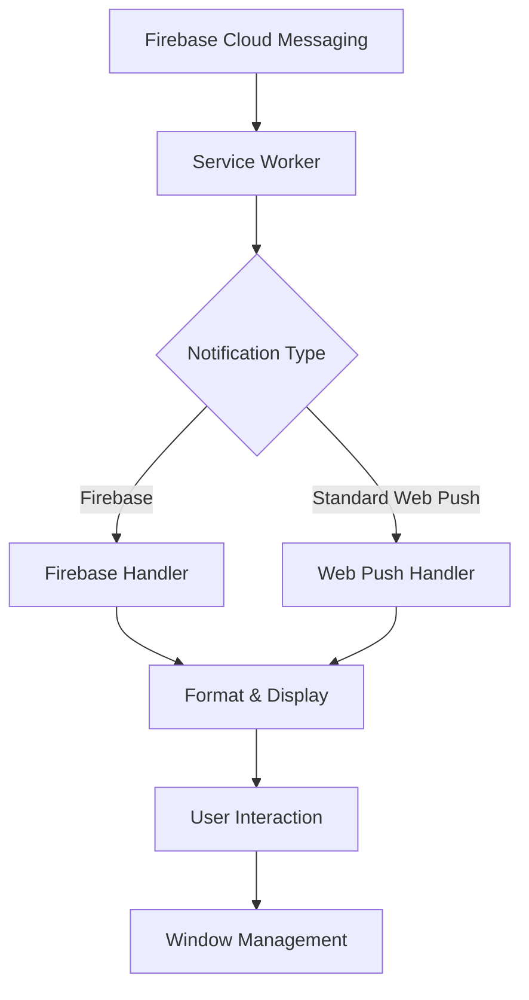

# **Firebase Push Notifications Integration Documentation**

## **Table of Contents**
1. [Overview](#overview)
2. [Architecture](#architecture)
3. [Service Worker Implementation](#service-worker-implementation)
4. [Client Registration](#client-registration)
5. [Notification Formatting](#notification-formatting)
6. [Event Handling](#event-handling)
7. [Configuration](#configuration)


---

## **1. Overview**

### **Purpose**
This documentation covers the Firebase Cloud Messaging (FCM) implementation for Vizuara's web application, enabling push notifications in both foreground and background states.

### **Key Features**
- ✅ Background notifications (app closed/minimized)
- ✅ Foreground notifications
- ✅ Custom notification formatting
- ✅ Notification actions (Open/Close)
- ✅ Cross-origin window management
- ✅ Firebase compatibility
- ✅ Fallback handling

---

## **2. Architecture**

### **System Flow**


### **Components**
1. **Service Worker** (`firebase-messaging-sw.js`) - Background notification processor
2. **Client Registration** (`main.tsx`) - Registers and configures service worker
3. **Firebase SDK** - Messaging and configuration

---

## **3. Service Worker Implementation**

### **File: `firebase-messaging-sw.js`**

### **3.1 Initialization & Setup**

```javascript
// Firebase SDK imports (compat version for broader browser support)
importScripts("https://www.gstatic.com/firebasejs/10.7.1/firebase-app-compat.js");
importScripts("https://www.gstatic.com/firebasejs/10.7.1/firebase-messaging-compat.js");

let firebaseConfig = null;
let messaging = null;
```

| Variable | Purpose | Scope |
|----------|---------|-------|
| `firebaseConfig` | Stores Firebase configuration | Module-level |
| `messaging` | Firebase Messaging instance | Module-level |

### **3.2 Firebase Initialization**

```javascript
const initializeFirebase = () => {
  if (firebaseConfig) {
    firebase.initializeApp(firebaseConfig);
    messaging = firebase.messaging();
    
    // Handle background messages from Firebase
    messaging.onBackgroundMessage((payload) => {
      try {
        const { title, options } = formatNotification(payload);
        self.registration.showNotification(title, options);
      } catch (e) {
        console.error("Service Worker: Error handling background message:", e);
      }
    });
  }
};
```

**Flow:**
1. Waits for Firebase config from main thread
2. Initializes Firebase app with config
3. Sets up background message listener
4. Formats and displays notifications

### **3.3 Configuration Reception**

```javascript
self.addEventListener("message", (event) => {
  if (event.data && event.data.type === "SET_FIREBASE_CONFIG") {
    firebaseConfig = event.data.payload;
    initializeFirebase();
  }
});
```

**Message Contract:**
```typescript
interface FirebaseConfigMessage {
  type: 'SET_FIREBASE_CONFIG';
  payload: {
    apiKey: string;
    authDomain: string;
    projectId: string;
    storageBucket: string;
    messagingSenderId: string;
    appId: string;
    measurementId?: string;
  };
}
```

---

## **4. Client Registration**

### **File: `main.tsx`**

```typescript
if ("serviceWorker" in navigator) {
  navigator.serviceWorker
    .register("/firebase-messaging-sw.js", {
      scope: "/",
    })
    .then((reg) => {
      console.log("Service Worker registered:", reg);
      
      // Send Firebase config to service worker
      reg.active?.postMessage({
        type: 'SET_FIREBASE_CONFIG',
        payload: firebaseConfig,
      });
    })
    .catch((err) => console.error("Service Worker registration failed:", err));
}
```

### **Registration Parameters**

| Parameter | Value | Purpose |
|-----------|-------|---------|
| File Path | `/firebase-messaging-sw.js` | Service worker script location |
| Scope | `/` | Controls which pages the SW controls |
| Config Passing | PostMessage | Securely transfers Firebase config |

### **Prerequisites**
1. **HTTPS Required**: Service workers only work over HTTPS (localhost exception)
2. **Browser Support**: Check `'serviceWorker' in navigator`
3. **Firebase Config**: Must be loaded before registration

---

## **5. Notification Formatting**

### **5.1 Configuration Object**

```javascript
const NOTIFICATION_CONFIG = {
  colors: {
    primary: "#FF6B35",    // Default/Info
    secondary: "#C5007E",  // Secondary theme
    accent: "#0066CC",     // Grading notifications
    success: "#10B981",    // Success notifications
    warning: "#F59E0B",    // Warning notifications
    error: "#EF4444",      // Error notifications
  },
  badge: "/logo.png",      // Small status icon
  icon: "/logo.png",       // Main notification icon
  placement: "top-right",  // Browser positioning
  duration: 5000,          // Auto-close timeout (ms)
  sound: true,             // Audible alerts
  vibrate: [200, 100, 200], // Vibration pattern
  actions: [               // Interactive buttons
    { action: "open", title: "Open", icon: "/logo.png" },
    { action: "close", title: "Close", icon: "/logo.png" },
  ],
};
```

### **5.2 Formatting Function**

```javascript
function formatNotification(payload) {
  // Extract title with fallbacks
  const title = payload?.notification?.title 
    || payload?.data?.title 
    || "Vizuara Notification";

  // Extract body
  const body = payload?.notification?.body 
    || payload?.data?.body 
    || "";

  // Generate unique tag for renotification handling
  const tag = payload?.data?.tag 
    || payload?.notification?.tag 
    || "vizuara-notification-" + Date.now();

  // Determine notification type
  const type = payload?.data?.type || "info";

  // Color coding based on type
  let color = NOTIFICATION_CONFIG.colors.primary;
  if (type === "SUCCESS") color = NOTIFICATION_CONFIG.colors.success;
  if (type === "WARNING") color = NOTIFICATION_CONFIG.colors.warning;
  if (type === "ERROR") color = NOTIFICATION_CONFIG.colors.error;
  if (type === "GRADING") color = NOTIFICATION_CONFIG.colors.accent;

  return {
    title,
    options: {
      body,
      tag,
      requireInteraction: type === "error" || type === "grading",
      badge: NOTIFICATION_CONFIG.badge,
      icon: NOTIFICATION_CONFIG.icon,
      image: payload?.notification?.image,
      timestamp: Date.now(),
      data: {
        url: payload?.data?.url || "/",
        type,
        color,
        ...payload?.data,
        ...payload?.notification,
      },
      actions: NOTIFICATION_CONFIG.actions,
      vibrate: NOTIFICATION_CONFIG.vibrate,
      silent: false,
      renotify: true,
    },
  };
}
```

### **Notification Types & Behaviors**

| Type | Color | Require Interaction | Use Case |
|------|-------|-------------------|----------|
| `info` | Primary (#FF6B35) | No | General announcements |
| `success` | Success (#10B981) | No | Completed actions |
| `warning` | Warning (#F59E0B) | No | Important alerts |
| `error` | Error (#EF4444) | **Yes** | Critical failures |
| `grading` | Accent (#0066CC) | **Yes** | Grading results |

---

## **6. Event Handling**

### **6.1 Push Event Handler (Standard Web Push)**

```javascript
self.addEventListener("push", (event) => {
  try {
    let payload = {};
    
    // Parse different payload formats
    if (event.data) {
      try {
        payload = event.data.json();  // JSON format
      } catch {
        payload = { notification: { body: event.data.text() } }; // Text format
      }
    }
    
    // Format and display notification
    const { title, options } = formatNotification(payload);
    
    event.waitUntil(
      self.registration.showNotification(title, options)
    );
  } catch (err) {
    // Fallback notification
    event.waitUntil(
      self.registration.showNotification("Vizuara", {
        body: "You have a new notification",
        icon: "/logo.png",
      })
    );
  }
});
```

### **6.2 Notification Click Handler**

```javascript
self.addEventListener("notificationclick", function (event) {
  event.notification.close();
  const url = event.notification.data?.url || "/";
  
  event.waitUntil(
    clients.matchAll({
      type: "window",
      includeUncontrolled: true,
    }).then((clientList) => {
      // Try to focus existing window
      for (const client of clientList) {
        if (client.url === url && "focus" in client) {
          return client.focus();
        }
      }
      
      // Open new window if none exists
      if (clients.openWindow) {
        return clients.openWindow(url);
      }
    })
  );
});
```

### **6.3 Notification Close Handler**

```javascript
self.addEventListener("notificationclose", function (event) {
  // Analytics or cleanup logic can go here
  console.log("Notification closed:", event.notification.data);
});
```

---

## **7. Configuration**

### **Required Assets**

```
/public
├── firebase-messaging-sw.js    # Service worker
├── logo.png                    # 192x192px (multiple sizes recommended)
```

### **Firebase Project Setup**

1. **Enable Firebase Cloud Messaging**
   - Go to Firebase Console → Project Settings → Cloud Messaging
   - Generate Web Push certificates
   - Add authorized domains

2. **Configure `firebaseConfig.ts`**
```typescript
export const firebaseConfig = {
  apiKey: import.meta.env.VITE_FIREBASE_API_KEY,
  authDomain: import.meta.env.VITE_FIREBASE_AUTH_DOMAIN,
  projectId: import.meta.env.VITE_FIREBASE_PROJECT_ID,
  storageBucket: import.meta.env.VITE_FIREBASE_STORAGE_BUCKET,
  messagingSenderId: import.meta.env.VITE_FIREBASE_MESSAGING_SENDER_ID,
  appId: import.meta.env.VITE_FIREBASE_APP_ID,
  measurementId: import.meta.env.VITE_FIREBASE_MEASUREMENT_ID,
};
```


c
