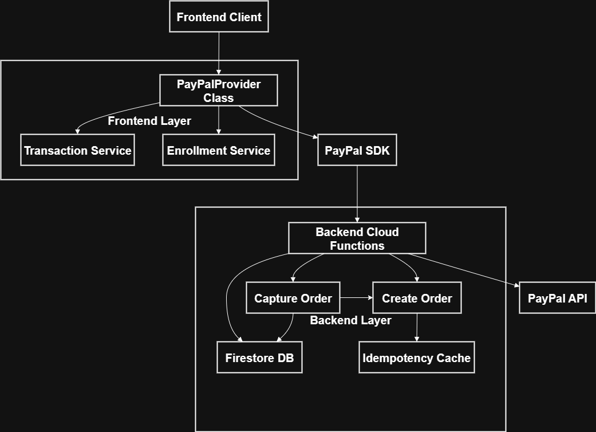
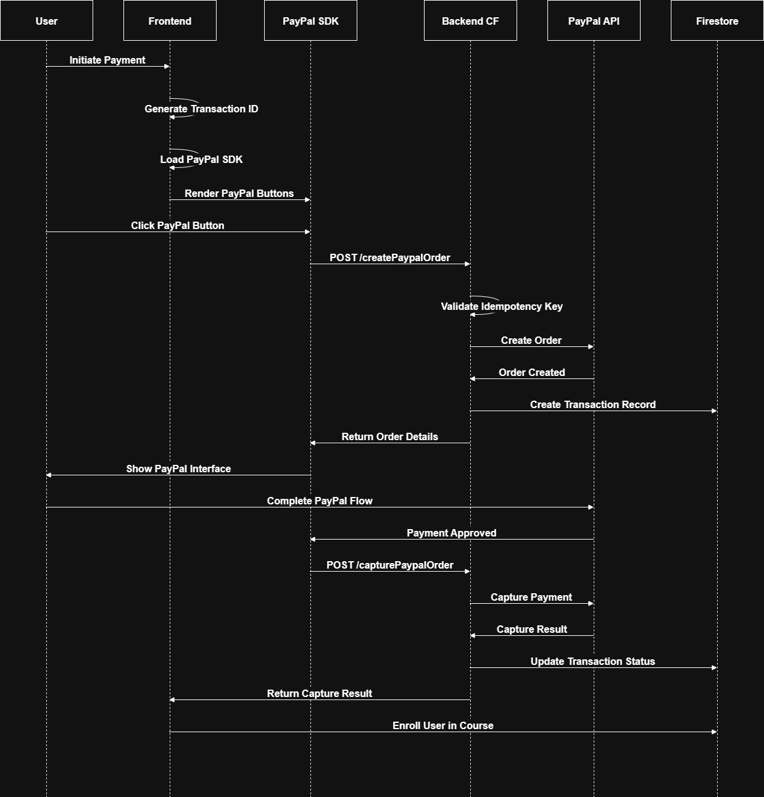
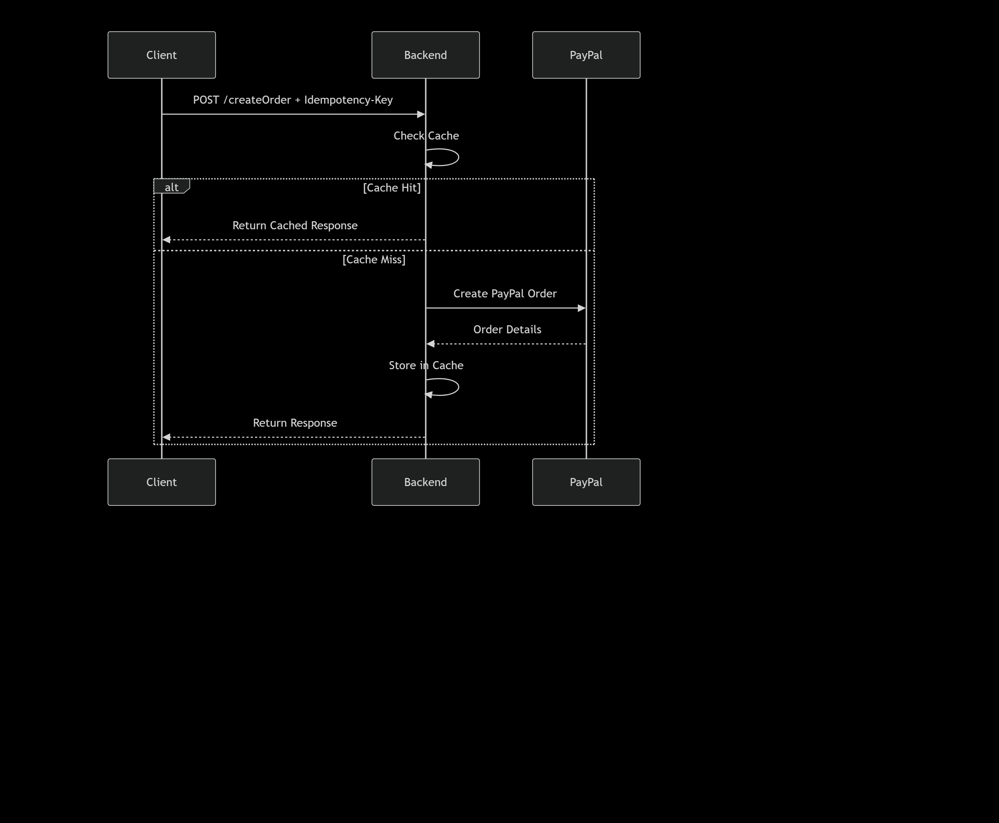
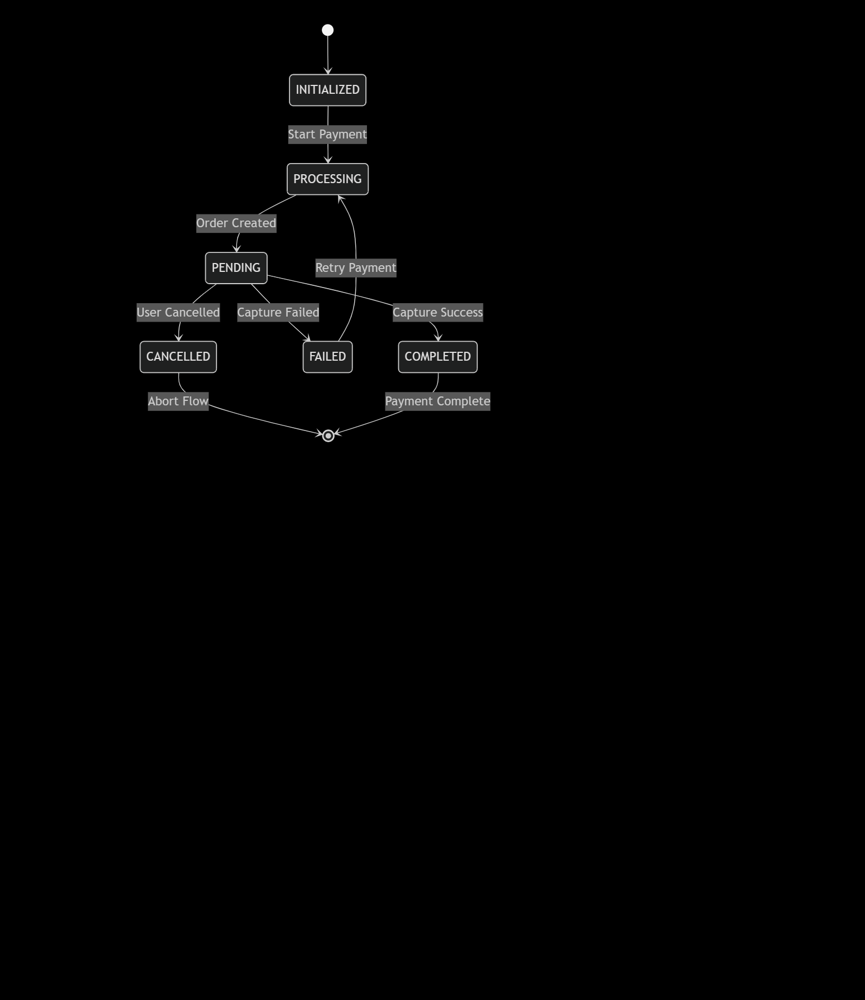

# PayPal Payment Integration Documentation

## 📋 Overview

This document provides a comprehensive analysis of the PayPal payment integration system, covering both backend Cloud Functions and frontend provider implementation.

## 🏗️ System Architecture



## 🔄 Payment Flow Sequence



## 📁 Backend Implementation Analysis

### 🔧 Cloud Function: `createPaypalOrder`

#### Purpose

Creates a PayPal order and initializes the payment process with idempotency protection.

#### Key Features

- **Idempotency Handling**: Prevents duplicate orders using cache
- **Input Validation**: Validates amount and currency
- **Transaction Tracking**: Creates Firestore transaction records
- **CORS Support**: Handles cross-origin requests

#### Code Structure

```typescript
interface CreateOrderRequest {
  rawamount: number; // Amount in cents
  rawcurrency: string; // Currency code
  description: string; // Order description
  transactionId: string; // Unique transaction identifier
}

interface CreateOrderResponse {
  success: boolean;
  order: PayPalOrder;
  clientId: string;
}
```

#### Security Measures

- Secret management for client credentials
- Input sanitization and validation
- Idempotency key validation
- CORS configuration

#### Error Handling

- 400: Missing idempotency key
- 405: Method not allowed
- 500: PayPal API errors

### 🔧 Cloud Function: `capturePaypalOrder`

#### Purpose

Captures a previously created PayPal order and completes the payment.

#### Key Features

- **Payment Capture**: Finalizes PayPal transaction
- **Status Updates**: Updates Firestore transaction status
- **Error Propagation**: Handles PayPal capture failures

#### Request Flow



## 🎨 Frontend Implementation Analysis

### 🏗️ PayPalProvider Class

#### Core Responsibilities

- **SDK Management**: Dynamic loading of PayPal JavaScript SDK
- **Payment Flow**: Orchestrates the entire payment process
- **State Management**: Handles transaction status updates
- **Error Handling**: Manages payment failures and user cancellations

#### Configuration

```typescript
interface PayPalConfig {
  environment: "production" | "sandbox";
  clientId: string;
  currency: string;
  intent: "capture";
}
```

### 🔄 Payment Process Flow

#### 1. Initialization Phase

```typescript
// Step 1: Load PayPal SDK
await paypalProvider.loadPayPalSDK();

// Step 2: Initialize transaction
transactionService.createTransaction({
  courseId: course.id,
  amount,
  currency: "USD",
  provider: "PAYPAL",
});
```

#### 2. Payment Execution

```typescript
paypal.Buttons({
  createOrder:    // Creates PayPal order via backend
  onApprove:      // Handles successful payment
  onCancel:       // Handles user cancellation
  onError:        // Handles payment errors
}).render('#paypal-button-container');
```

## 🛡️ Idempotency Implementation

### Cache Mechanism

```typescript
// Local in-memory cache for idempotency
const paypalIdempotencyCache = new Map<string, any>();

// Flow: Idempotency Check
if (paypalIdempotencyCache.has(idempotencyKey)) {
  return cachedResponse;
}
```

## 📊 Data Models

### Transaction Record (Firestore)

```typescript
interface Transaction {
  id: string;
  status: "PENDING" | "COMPLETED" | "FAILED" | "CANCELLED" | "PROCESSING";
  provider: "PAYPAL";
  expectedAmount: number; // in cents
  currency: string;
  createdAt: number; // timestamp
  completedAt?: number; // timestamp
  paypal_order_id?: string;
  captureData?: any; // PayPal capture response
}
```

### PayPal Order Structure

```typescript
interface PayPalOrder {
  id: string;
  status: string;
  intent: "CAPTURE";
  purchase_units: Array<{
    amount: {
      currency_code: string;
      value: string; // formatted amount "10.00"
    };
    description: string;
    custom_id: string; // transactionId
  }>;
}
```

## 🔐 Security Considerations

### Backend Security

- **Secret Management**: Client ID/Secret stored as environment secrets
- **Input Validation**: Amount and currency validation
- **CORS Configuration**: Proper cross-origin settings
- **Idempotency**: Prevents duplicate payments

### Frontend Security

- **Environment-based Configuration**: Separate sandbox/production settings
- **SDK Integrity**: Official PayPal SDK loading
- **Error Handling**: Secure error propagation

## ⚡ Performance Optimizations

### Backend Optimizations

- **Idempotency Cache**: Reduces PayPal API calls
- **Connection Reuse**: HTTP keep-alive for PayPal API
- **Early Returns**: Efficient request handling

### Frontend Optimizations

- **Lazy SDK Loading**: Loads PayPal SDK only when needed
- **Promise-based**: Asynchronous operation handling
- **State Management**: Efficient status updates

## 🚨 Error Handling Strategy

### Backend Error Categories

```typescript
enum BackendErrors {
  VALIDATION_ERROR = "Missing or invalid parameters",
  PAYPAL_API_ERROR = "PayPal API communication failed",
  IDEMPOTENCY_ERROR = "Missing idempotency key",
  NETWORK_ERROR = "Network connectivity issues",
}
```

### Frontend Error Handling

```typescript
// Comprehensive error scenarios
onApprove:    // Payment capture failures
onCancel:     // User-initiated cancellation
onError:      // PayPal SDK errors
catchBlocks:  // General exceptions
```

## 🔄 State Management Flow



## 📈 Monitoring and Logging

### Key Log Points

```typescript
// Backend Logging
console.log("✅ PayPal Order created:", order);
console.error("❌ Failed to create PayPal order:", err);

// Frontend Logging
console.log("PayPalProvider - Starting payment process");
console.error("PayPalProvider - Enrollment failed:", enrollmentError);
```

### Critical Metrics to Monitor

- PayPal API response times
- Order creation success rate
- Payment capture success rate
- Idempotency cache hit rate
- Transaction completion time

## 🛠️ Deployment Considerations

### Environment Configuration

```bash
# Sandbox Environment
VITE_APP_ENVIRONMENT=sandbox
VITE_PAYPAL_SANDBOX_CLIENT_ID=your_sandbox_client_id

# Production Environment
VITE_APP_ENVIRONMENT=production
VITE_PAYPAL_LIVE_CLIENT_ID=your_live_client_id
```

### Backend Configuration

```typescript
// Switch to live in production
const base = "https://api-m.sandbox.paypal.com";
// Production: "https://api-m.paypal.com"
```

## 🔄 Recovery and Retry Mechanisms

### Idempotent Operations

- Order creation can be safely retried
- Capture operations are idempotent by PayPal design
- Transaction status updates are atomic

### Failure Recovery

```typescript
// Frontend recovery flow
try {
  await paymentProcess();
} catch (error) {
  // Update transaction status
  // Provide user feedback
  // Allow retry
}
```
