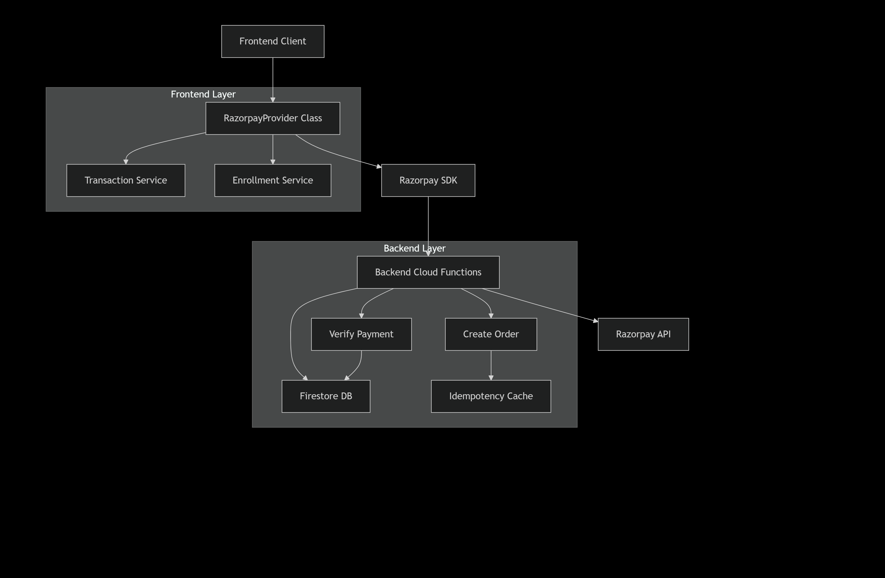
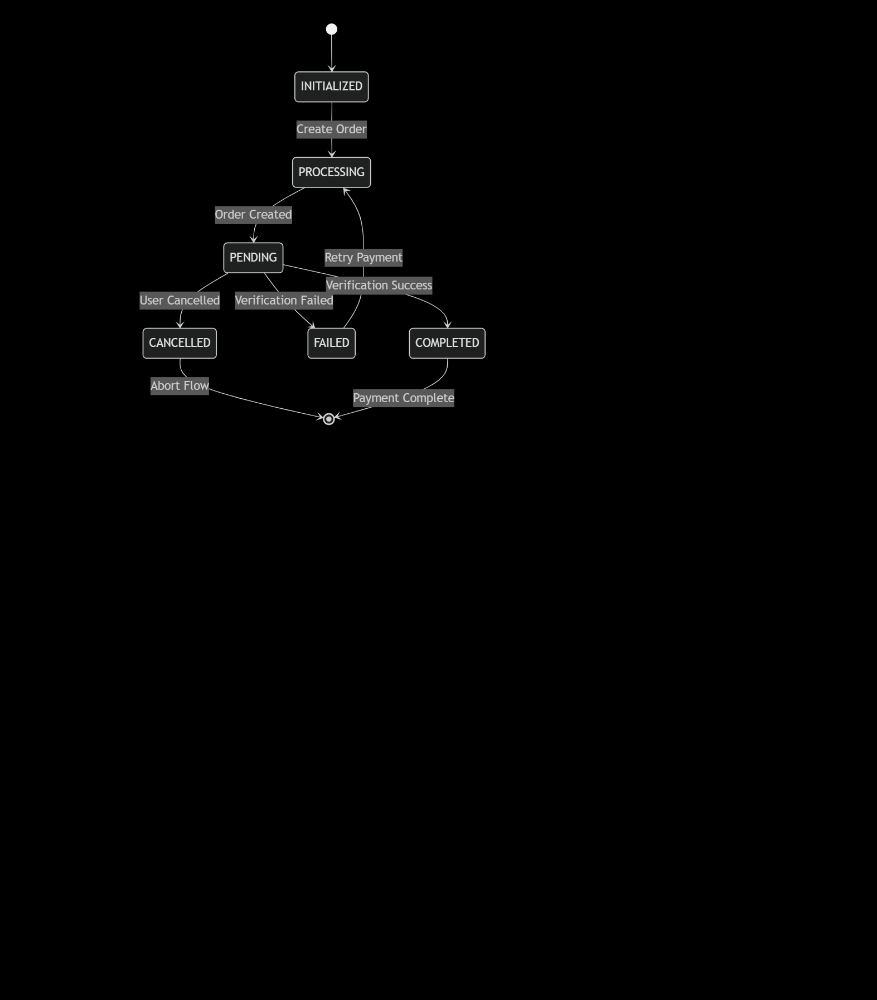

# Razorpay Payment Integration - Detailed Technical Analysis

## 🏗️ System Architecture


## 🔄 Payment Flow Sequence


## 📁 Backend Implementation Analysis

### 🔧 Cloud Function: `createOrder`

#### Purpose
Creates a Razorpay order with idempotency protection and proper amount handling for Indian payment processing.

#### Key Features
- **Idempotency Handling**: Prevents duplicate orders using memory cache
- **Amount Conversion**: Converts rupees to paise for Razorpay API
- **Input Validation**: Comprehensive amount and currency validation
- **CORS Support**: Handles cross-origin requests

#### Code Structure
```typescript
interface CreateOrderRequest {
  rawamount: number;    // Amount in rupees
  rawcurrency: string;  // Currency code (INR)
  receipt: string;      // Transaction reference
}

interface CreateOrderResponse {
  success: boolean;
  order: RazorpayOrder;
  key_id: string;       // Razorpay key for frontend
}
```

#### Security Measures
- Secret management for API credentials
- Input sanitization and validation
- Idempotency key validation
- CORS configuration

### Amount Processing Pipeline
```typescript
const rawamountNum = Number(rawamount);
const amountInPaise = Math.round(rawamountNum * 100); // Convert to paise
const amount = validateAmount(amountInPaise); // Validate in paise

const order = await instance.orders.create({
  amount,        // In paise
  currency,      // INR
  receipt,       // Transaction reference
  payment_capture: 1, // Auto-capture payments
});
```

**Key Conversion**: ₹100 → 10000 paise for Razorpay API

### 🔧 Cloud Function: `verifyPayment`

#### Purpose
Verifies payment authenticity through HMAC signature validation and updates transaction status.

#### Multi-Layer Verification
```typescript
// 1. HMAC Signature Validation
const body = `${razorpay_order_id}|${razorpay_payment_id}`;
const expectedSignature = crypto
  .createHmac("sha256", razorpayKeySecret.value())
  .update(body)
  .digest("hex");

// 2. Database Transaction Check
const txnSnap = await txnRef.get();
if (txnSnap.exists && txnSnap.data()!.status === "COMPLETED") {
  // Idempotent success response
}

// 3. Razorpay API Verification
const payment = await instance.payments.fetch(razorpay_payment_id);
if (payment.status !== "captured") {
  throw new Error("Payment not captured");
}
```

## 🎨 Frontend Implementation Analysis

### 🏗️ RazorpayProvider Class

#### Core Responsibilities
- **Order Creation**: Coordinates with backend for Razorpay order
- **Payment Flow**: Manages Razorpay checkout initialization
- **Verification**: Handles payment verification workflow
- **State Management**: Updates transaction status throughout lifecycle

#### Configuration
```typescript
interface RazorpayConfig {
  key: string;           // Razorpay key_id
  amount: number;        // Amount in paise
  currency: string;      // INR
  order_id: string;      // Razorpay order ID
  name: string;          // Merchant name
  description: string;   // Product description
  prefill: {             // Customer prefill
    email: string;
  };
  theme: {               // UI customization
    color: string;
  };
}
```

### 🔄 Payment Process Flow

#### 1. Order Creation Phase
```typescript
// Step 1: Create backend order
const orderData = await this.createOrder(
  amount,           // In rupees
  CURRENCY.INR, 
  transactionId,    // Used as receipt
  transactionId     // Used as idempotency key
);

// Step 2: Update transaction status
await transactionService.updateTransactionStatus(
  transactionId, 
  TRANSACTION_STATUS.PROCESSING, 
  { orderId: order.id }
);
```

#### 2. Razorpay Checkout Initialization
```typescript
const options = {
  key: key_id,                    // From backend response
  amount: order.amount,           // In paise from Razorpay
  currency: order.currency,       // INR
  order_id: order.id,             // Razorpay order ID
  name: 'Vizuara AI Labs',
  description: `Enrollment for ${course.title}`,
  prefill: { email: userEmail },
  theme: { color: '#3b82f6' },
  
  handler: async (response) => {
    // Payment success handling
  },
  
  modal: {
    ondismiss: async () => {
      // User cancellation handling
    }
  }
};
```

### Payment Lifecycle Event Handlers

#### Success Flow (handler)
```typescript
handler: async (response: any) => {
  try {
    // Backend verification
    const verificationResponse = await fetch(`${this.backendUrl}/verifyPayment`, {
      method: 'POST',
      body: JSON.stringify({
        razorpay_order_id: response.razorpay_order_id,
        razorpay_payment_id: response.razorpay_payment_id,
        razorpay_signature: response.razorpay_signature,
        transaction_id: transactionId,
      }),
    });

    const verificationData = await verificationResponse.json();

    if (verificationData.success) {
      // Update transaction
      await transactionService.updateTransactionStatus(
        transactionId, 
        TRANSACTION_STATUS.COMPLETED, 
        {
          orderId: order.id,
          paymentId: response.razorpay_payment_id,
          signature: response.razorpay_signature,
        }
      );

      // Enroll user
      await enrollmentService.enrollUser(
        userId,
        course.id,
        response.razorpay_payment_id,
        'razorpay'
      );

      resolve({ success: true, transactionId, paymentId: response.razorpay_payment_id });
    }
  } catch (error) {
    // Error handling
  }
}
```

#### User Cancellation (ondismiss)
```typescript
modal: {
  ondismiss: async () => {
    console.log('RazorpayProvider - Payment dismissed by user');
    await transactionService.updateTransactionStatus(
      transactionId, 
      TRANSACTION_STATUS.CANCELLED, 
      {} as PaymentDetails, 
      'Payment cancelled by user'
    );
    resolve({ success: false, error: 'Payment cancelled by user' });
  }
}
```

## 🛡️ Security Implementation

### Backend Security Measures

#### HMAC Signature Verification
```typescript
const body = `${razorpay_order_id}|${razorpay_payment_id}`;
const expectedSignature = crypto
  .createHmac("sha256", razorpayKeySecret.value())
  .update(body)
  .digest("hex");

if (expectedSignature !== razorpay_signature) {
  console.warn("❌ Invalid signature", {
    expectedSignature,
    razorpay_signature,
  });
  res.status(400).json({ success: false, error: "Invalid signature" });
  return;
}
```

**Purpose**: Ensures payment response authenticity from Razorpay
**Algorithm**: SHA-256 HMAC
**Input**: order_id + payment_id concatenation

#### Multi-Layer Validation
1. **Signature Verification**: HMAC validation
2. **Database Check**: Transaction existence and status
3. **API Verification**: Razorpay payment status confirmation

### Frontend Security Practices

#### Secure Order Creation
```typescript
const safeReceipt = (receipt || "").substring(0, 40); // Length validation

const response = await fetch(`${this.backendUrl}/createOrder`, {
  method: 'POST',
  headers: {
    'Content-Type': 'application/json',
    'Idempotency-Key': transactionId, // Reuse transaction ID
  },
  body: JSON.stringify({
    rawamount: amount,
    rawcurrency: currency,
    receipt: safeReceipt,
  }),
});
```

## ⚡ Amount Handling System

### Currency Conversion Pipeline

#### Frontend (Rupees)
```typescript
// User sees: ₹100
// Frontend sends: 100 (rupees)
const amount = 100; // In rupees
```

#### Backend Conversion (Rupees → Paise)
```typescript
const rawamountNum = Number(rawamount); // 100 rupees
const amountInPaise = Math.round(rawamountNum * 100); // 10000 paise
const amount = validateAmount(amountInPaise); // Validate 10000 paise
```

#### Razorpay Processing
```typescript
const order = await instance.orders.create({
  amount: 10000,    // 10000 paise = ₹100
  currency: 'INR',
  receipt: 'txn_123',
  payment_capture: 1
});
```

## 🔄 Idempotency Implementation

### Client-Side Idempotency
```typescript
// Reuse transaction ID as idempotency key
'Idempotency-Key': transactionId

// Request body
body: JSON.stringify({
  rawamount: amount,
  rawcurrency: currency,
  receipt: safeReceipt,
})
```

### Server-Side Cache Management
```typescript
// Memory cache (production: use Redis/Firestore)
const idempotencyCache = new Map<string, any>();

// Cache check
if (idempotencyCache.has(idempotencyKey)) {
  console.log(`♻️ Returning cached order for key: ${idempotencyKey}`);
  res.json(idempotencyCache.get(idempotencyKey));
  return;
}

// Cache storage
idempotencyCache.set(idempotencyKey, response);
```

## 📊 Data Models

### Transaction Record (Firestore)
```typescript
interface Transaction {
  id: string;
  status: 'PENDING' | 'COMPLETED' | 'FAILED' | 'CANCELLED' | 'PROCESSING';
  provider: 'RAZORPAY';
  expectedAmount: number;    // in rupees
  currency: string;          // INR
  createdAt: number;         // timestamp
  completedAt?: number;      // timestamp
  orderId?: string;          // Razorpay order ID
  paymentId?: string;        // Razorpay payment ID
  signature?: string;        // HMAC signature
}
```

### Razorpay Order Structure
```typescript
interface RazorpayOrder {
  id: string;
  amount: number;        // in paise
  currency: string;      // INR
  receipt: string;       // transaction reference
  status: string;        // created, attempted, paid
}
```

## 🚨 Error Handling Strategy

### Backend Error Categories

#### Create Order Errors
- **400**: Missing idempotency key, invalid amount/currency
- **405**: Incorrect HTTP method
- **500**: Razorpay API failures, validation errors

#### Verify Payment Errors
- **400**: Invalid signature, payment not captured
- **404**: Transaction not found
- **500**: Razorpay API connectivity issues

### Frontend Error Recovery

#### Comprehensive Error Scenarios
```typescript
// Order creation failure
if (!orderData.success) {
  throw new Error(orderData.error || 'Order creation failed');
}

// SDK loading failure
if (!(window as any).Razorpay) {
  await transactionService.updateTransactionStatus(
    transactionId, 
    TRANSACTION_STATUS.FAILED, 
    {} as PaymentDetails, 
    'Razorpay SDK not loaded'
  );
}

// Verification failure
if (!verificationData.success) {
  throw new Error(verificationData.error || 'Payment verification failed');
}
```

## 🔄 State Management Flow


## 📈 Monitoring and Logging

### Key Log Points
```typescript
// Backend Logging
console.log("✅ Order created:", order);
console.warn("❌ Invalid signature", { expectedSignature, razorpay_signature });
console.error("❌ Failed to create Razorpay order:", err);

// Frontend Logging
console.log('RazorpayProvider - Starting payment process:', { courseId, transactionId, amount });
console.log('Razorpay payment successful:', response);
console.error('RazorpayProvider - Enrollment failed:', enrollmentError);
```

### Critical Metrics to Monitor
- Razorpay API response times
- Order creation success rate
- Payment verification success rate
- HMAC signature failure rate
- Transaction completion time

## 🛠️ Deployment Considerations

### Environment Configuration
```typescript
private readonly backendUrl = import.meta.env.VITE_BACKEND_URL;

// Razorpay keys managed via Firebase Secrets
const razorpayKeyId = defineSecret("RAZORPAY_KEY_ID");
const razorpayKeySecret = defineSecret("RAZORPAY_KEY_SECRET");
```

### Production Optimizations

#### Persistent Idempotency Cache
```typescript
// Current: In-memory cache (reset on cold starts)
const idempotencyCache = new Map<string, any>();

// Production: Redis/Firestore based cache
// Implement TTL and distributed cache management
```

#### Enhanced Error Handling
- Structured logging with correlation IDs
- Retry mechanisms for transient failures
- Circuit breaker pattern for Razorpay API

## 🔮 Potential Improvements

### Immediate Enhancements
1. **Persistent Cache**: Replace in-memory cache with Redis/Firestore
2. **Webhook Support**: Add Razorpay webhook for payment notifications
3. **Enhanced Validation**: Additional fraud detection mechanisms
4. **Rate Limiting**: Implement request rate limiting

### Future Considerations
1. **Payment Method Expansion**: Support UPI, NetBanking, Wallets
2. **Subscription Support**: Recurring payments implementation
3. **Analytics Integration**: Detailed payment analytics
4. **International Support**: Multi-currency handling

## ⚡ Performance Optimizations

### Backend Optimizations
- **Idempotency Cache**: Reduces Razorpay API calls
- **Early Returns**: Efficient request termination
- **Connection Reuse**: Razorpay SDK connection pooling

### Frontend Optimizations
- **Lazy SDK Loading**: Razorpay SDK loaded on demand
- **Promise-based Flow**: Non-blocking asynchronous operations
- **Efficient State Updates**: Minimal re-renders through external services

